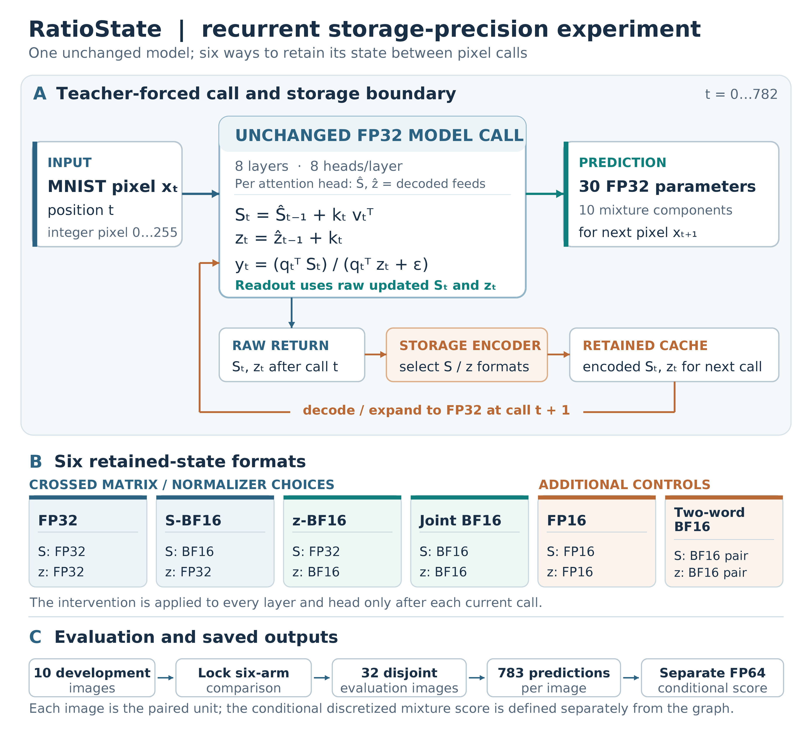

# RatioState reproduction code and saved results

**Matrix and normalizer storage precision in recurrent linear attention: an experimental evaluation on MNIST** — Woncheol Jeong, Sungkyunkwan University, Republic of Korea. This repository contains the numerical code, selected saved inputs, and machine-readable outputs for one pretrained MNIST recurrent linear-attention case study. The planned article venue is *Applied Intelligence*; no journal acceptance or DOI is claimed.



[Figure 1 caption and accessible alt text](figures/system_overview_caption_alt.md).

The reported fixed32 evaluation compares FP32, matrix-only BF16, normalizer-only BF16, joint BF16, FP16, and a two-word BF16 residual cache. Across 32 selected images, protecting the normalizer on a BF16 matrix reduced the mean conditional negative log score by 0.005551 bits per predicted pixel (original pointwise 95% bootstrap interval 0.003426–0.007740); 23 images improved and nine worsened. This is one checkpoint and an idealized saved-prediction metric, not a general model-family or training-loss claim. The later selected-state mass analysis is retrospective and not a causal mediation test. See `protocols/METHODS.md` and `results/README.md` for definitions and limits.

## Quick saved-data replay

Tested on Linux/Python 3.10.12 with NumPy 1.26.4. If needed, create a separate Python 3.10.12 environment and install `requirements-saved.txt` with `python3 -m pip install -r requirements-saved.txt`; this is a setup recipe, and a new clean installation was not tested. With the compatible environment active, run from the repository root. Replace the example output path with a fresh writable **absolute directory outside this checkout**; the command refuses an existing path. It reads the included predictions and selected pixels, computes all 252 score cells and paired contrasts, and never downloads data, trains or runs the graph:

```sh
CUDA_VISIBLE_DEVICES='' OMP_NUM_THREADS=2 OPENBLAS_NUM_THREADS=2 MKL_NUM_THREADS=2 python3 -I -B saved/fixed32/replay.py --output /replace/with/unused/absolute/saved-score-output
```

`requirements-saved.txt` pins the numerical packages. The exact scorer is `saved/fixed32/score_lineage.py`; `inference/scripts/score_browser_precision.py` is its source lineage. To reproduce the original four-image coupling rows and six recorded timing ratios, follow `saved/legacy/README.md`. To regenerate the retrospective position and selected-state outputs, follow `analysis/README.md`. Figures 2–4 plotting code and frozen inputs, plus the editable conceptual Figure 1, are under `figures/`; use `figures/README.md` and `requirements-figures.txt`. Figure input paths are local, and figure outputs should be fresh directories outside the checkout.

All 252 score-input predictions and selected pixels are retained in `saved/fixed32/`; all 192 selected state trace sets are in `state_inputs/runs/`. `results/` holds the reported score, contrast, position and mass outputs. The large 93,597,209-byte `state_coordinate_ratios_v2.npz` is intentionally omitted because `analysis/analyze_saved_v2.py` recreates it from the retained arrays; its original hash remains in the saved summary. A few small inputs occur in both their executable component and figure-data layouts to preserve the unchanged scripts. No individual repository file exceeds GitHub's 100 MiB limit.

Optional fresh six-arm graph inference for saved image 6116 is documented in `inference/README.md`; the model graph, seven weight shards, full MNIST files, installed TFJS runtime and any trained checkpoint are not redistributed. Upstream URLs, exact model/data hashes and access limits are in `protocols/ACQUISITION.md`. Component package manifests and the public scientific extracts under `protocols/` establish local identities; their reported dates and hashes do not authenticate an external preregistration timestamp.

`LICENSE` applies MIT only to original RatioState-owned code. Read `RIGHTS.md` for the narrower scope of data, model, runtime and third-party rights. This repository does not contain article manuscript files, reviewer records or private project operations.
